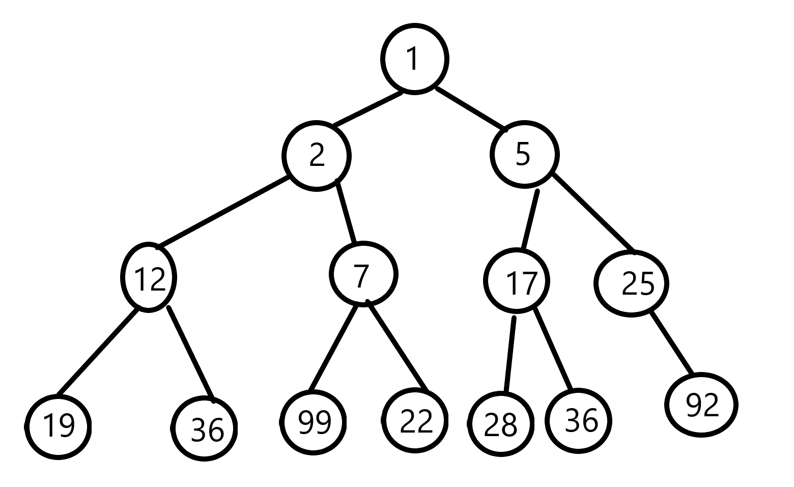

# 第4次隨堂-隨堂-QZ4
>
>學號：112111219
> 
>姓名：陳恩偉
> 
>作業撰寫時間：60 (mins，包含程式撰寫時間)
> 
>最後撰寫文件日期：2024/12/30
>

本份文件包含以下主題：(至少需下面兩項，若是有多者可以自行新增)
- [x] 說明內容
- [x] 個人認為完成作業須具備觀念

## 說明程式與內容

1. 請參閱投影片Topic5的第31至35頁，請用物件導向方式進行新增與刪除。 (請參照題目pdf)

Ans:

## 個人認為完成作業須具備觀念

開始寫說明，需要說明本次練習需學會那些觀念 (需寫成文章，需最少50字，並且文內不得有你、我、他三種文字)且必須提供完整與練習相關過程的notion筆記連結

在本次練習中，需掌握以下觀念：首先，了解最小堆積樹與最大堆積樹的基本定義與特性，包括父節點與子節點之間的關係。其次，熟悉堆積樹的構建過程，尤其是完整二元樹的建立與堆積化處理的細節。最後，需學會通過交換節點值實現符合堆積屬性的調整步驟，以正確完成堆積樹的生成與轉換。